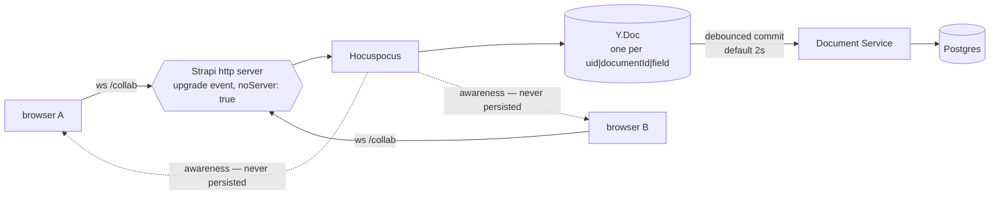
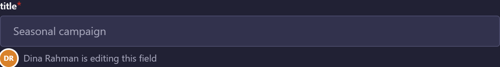
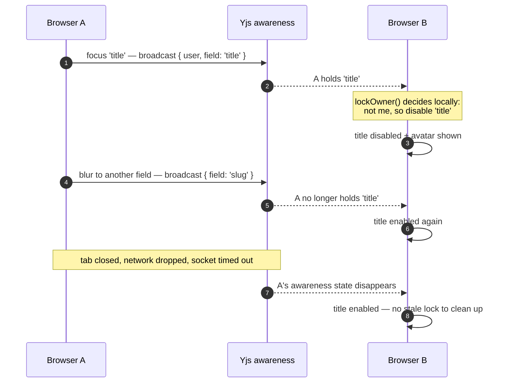
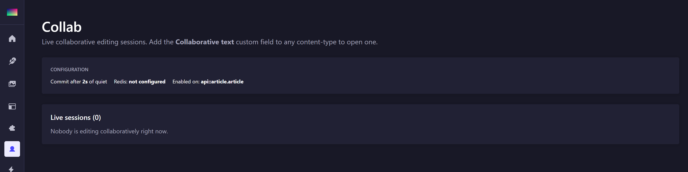

# strapi-plugin-collab

[](https://www.npmjs.com/package/strapi-plugin-collab)      

Collaborative editing for Strapi 5, in two layers:

- **Field locking on every field.** While someone is editing a field, it is disabled for
  everyone else, with an avatar saying who. Works on any content-type, with nothing to model.
- **Concurrent editing in one field**, for fields declared as this plugin's collaborative
  text type: two people typing in the same box, with presence and cursors, backed by **Yjs**
  CRDTs over a **Hocuspocus** server running inside the Strapi process.

The first is what prevents the collision people actually hit; the second is for when you want
two people in the same paragraph.

One of a family of standalone Strapi 5 plugins — see [the others](https://github.com/rhyoharianja?tab=repositories).

## Install

```bash
pnpm add strapi-plugin-collab
```

```ts
// config/plugins.ts
export default {
  'collab': {
    enabled: true,
    resolve: 'strapi-plugin-collab',
    config: {
      // Opt-in: real-time editing is a live surface, not a default.
      contentTypes: ['api::article.article'],
      debounceSeconds: 2,
    },
  },
};
```

> **Keep the key `collab` exactly as it is.** It is the plugin id, and the id is
> compiled into the package — the admin menu link, the `plugin::collab.*`
> custom-field uids, the route prefix and every internal `strapi.plugin(...)` lookup.
> Renaming it does not rename those, so the plugin half-loads and fails in ways that do
> not look like a naming problem. `resolve` points at the package; the key does not.

Then add the field to a content-type:

```jsonc
"editorialNotes": {
  "type": "customField",
  "customField": "plugin::collab.text"
}
```

Collaboration is opted into **twice** — per content-type in config, and per field in the
schema — because it is expensive and surprising, and nobody should discover it by accident.

## How it runs

Hocuspocus is attached to **Strapi's own HTTP server** through its `upgrade` event with
`noServer: true`. One process, one port, nothing extra to deploy, and the WebSocket
handshake carries the same origin as the admin panel.



Note the two kinds of traffic. The **document** is a CRDT that gets committed to Postgres;
**awareness** — who is here, which field each holds — is ephemeral and is never written down.
That distinction is what makes field locking self-healing, below.

One CRDT per **field of one entry**, named `uid|documentId|field`. Two people editing
different fields of the same article never contend, and a smaller document is cheaper to
sync and persist.

> The separator is `|`, not `::`. A content-type UID *is* `api::article.article`, so
> splitting on `::` yields four parts and every session is refused as malformed.

### Two things Hocuspocus 4 needs from an embedder

Both are easy to miss and both fail silently:

1. **It takes a web `Request`, not Node's `IncomingMessage`** — v4 moved to crossws. Rebuild
   one from the upgrade request so the query string and headers survive.
2. **It no longer listens on the socket itself.** Its adapter feeds the connection, so an
   embedder must pump messages across by hand:
   `ws.on('message', d => connection.handleMessage(new Uint8Array(d)))` and
   `ws.on('close', () => connection.handleClose())`. Without this the handshake succeeds and
   then nothing ever syncs — which looks exactly like a connection failure.

## Authentication and permissions

> **The token comes from the Auth context, never from storage.** Both the presence connection
> and the collaborative field used to read `jwtToken` out of `localStorage`/`sessionStorage`
> by hand. Strapi 5 only persists it there when "remember me" was used; otherwise it lives in
> memory behind an httpOnly cookie, so the read returned an empty string and the server logged
> `refused …|__presence: No token presented` while the UI looked perfectly fine. Read it with
> `useAuth('…', (auth) => auth.token, true)`.

Each connection presents the admin token. It is verified by asking Strapi's own
`/admin/users/me` rather than decoding the JWT: the token format is internal and moved to
session tokens in 5.52 (the helper that used to decode it is gone), whereas that endpoint is
the stable contract and always agrees with however the panel currently authenticates.

**The session is authorised, not each keystroke.** That is the only place field-level
permission can apply here: the eventual commit happens outside any HTTP request, so the
[field-RBAC](https://github.com/rhyoharianja/strapi-plugin-rbac) middleware sees no acting user and
treats it as a system write. If the user's role may not write the field, the session joins
**read-only** — they still see the live document and who else is in it, they just cannot
type. Refusing outright would be less useful and no safer.

## Persistence

- **On load** the CRDT is seeded from the stored value, but only when it is empty. Once a
  session is live the CRDT is the truth; re-seeding would duplicate everything typed so far.
- **On store** the text is written back through the Document Service, debounced by
  `debounceSeconds` (default 2s, capped at 5×). Persisting every keystroke would write to
  Postgres dozens of times a second per editor.
- **On shutdown** pending commits are flushed before connections close, so a dev-server
  reload does not cost work.

The commit is an ordinary document write, so content flows still fire on it.

## Field locking



Focus a field and every other browser disables it, showing your avatar beside it. Move away
and it unlocks.



**Nothing grants a lock.** Each browser broadcasts which field it is in through Yjs
awareness, and every other browser decides for itself what that means. There is no lock
record, which is what makes "unlocks when users move away" true for free: awareness is
dropped when a tab closes, a network drops or a socket times out, so a lock cannot outlive
the person holding it. A server that had to approve a claim would also put a round trip
between clicking a field and being allowed to type in it.

### The release rule is narrower than "on blur"

A lock is released when focus **leaves the field**, not on every blur — and getting that wrong
is what made locking appear not to work at all for a while.

A Strapi input moves focus between its own inner elements: a wrapper and then the real input, a
select's trigger and then its listbox. Each hop fires a blur for the element being left, so
releasing on every blur claimed and dropped the lock within milliseconds and no peer ever saw
it held. The rule reads `relatedTarget` — the element *receiving* focus — and keeps the lock
while that is still inside the field's wrapper.

One consequence worth knowing: a **window-level** blur (switching tab or application) carries a
null `relatedTarget`, which counts as "focus left the document" and **keeps** the claim. That is
correct — you have not moved away from the field — and closing the tab drops the awareness
state anyway, which releases it for real.

A contested field resolves **deterministically**, by lowest user id, rather than by whoever
arrived first. Awareness is eventually consistent: for a moment both browsers can see both
presences, and if each picked "the other one" the field would be disabled for everyone with
nothing to explain why.

### How a plugin can disable an arbitrary field

`addFields` registers an input for a built-in type, and the Content Manager consults that
registry **before** its own switch — the same mechanism the upload plugin uses to own the
`media` input. So one registration per type puts a lock-aware wrapper in front of every plain
field in the panel.

The wrapper renders nothing itself: it delegates to Strapi's own `InputRenderer` and only
adds a `disabled` and an avatar. That is also what bounds it — `LOCKABLE_TYPES` lists the
types that renderer can draw:

| Locked | Not locked |
| ------ | ---------- |
| string, text, uid, email, password | relation, media |
| integer, biginteger, decimal, float | component, dynamiczone |
| boolean, date, datetime, time, timestamp | richtext, blocks |
| enumeration, json | |

A relation or dynamic zone is drawn by the Content Manager with components it does not
export, so wrapping one would mean rebuilding it — and a half-rebuilt relation picker is a
worse outcome than an unlocked field.

The wrappers are rendered deep inside the Content Manager's tree, with no ancestor of ours
above them, while the WebSocket is owned by a component injected elsewhere in that same tree.
There is no provider the two could share, so the session lives in a module store — see
`admin/src/session/store.ts`.

### What locking is not

It stops two people typing into the same box, which is the collision that happens. It is
**not a transaction**: Strapi saves an entry as a whole, so two people editing *different*
fields still race on save and the last save wins. Preventing that needs per-field
persistence, which Strapi does not do.

## Admin



- **Collab** in the menu: live sessions, how many editors are in each, and the effective
  configuration. Polled every 5s — giving this page its own socket would cost a connection
  per open tab for information that is never urgent.
- The **entry panel** shows everyone with the entry open, and what field each is in:

  

- A **collaborative text field** additionally shows connection state and caret positions.
  Colours are derived from the user id, so the same person looks the same in every browser.

## Trying it with two people

Locking and presence only exist between two sessions, so a single browser window shows
nothing — which is easy to mistake for the feature being broken.

1. Create a second admin user: `npx strapi admin:create-user -e second@example.test -p '…' -f Second -l User`
2. Open the **same entry** in two browser profiles, or one normal and one private window. Two
   tabs of the same profile share a session and count as one person.
3. Click into a field in window B. In window A that field greys out with B's avatar under it.
4. Click into a different field in B. The first unlocks, the second locks.
5. Close window B. The lock disappears on its own — there is no record to clean up.

> Two tabs of the *same* user are deliberately counted as one person: the same editor with two
> tabs open is still one person to collide with. The tab actually holding a field wins, so an
> idle second tab cannot mask a real lock.

A brand-new entry has no document id yet, so the field behaves as a plain textarea until the
entry has been saved once.

## Horizontal scale

Each instance holds its documents in memory, so **two Strapi instances would not see each
other's edits**. For more than one replica, add the Redis extension:

```bash
pnpm add @hocuspocus/extension-redis
```

```dotenv
COLLAB_REDIS_HOST=127.0.0.1
COLLAB_REDIS_PORT=6380
```

The admin page reports whether Redis is configured.

> **TODO — not yet exercised.** The env plumbing and the status flag are in place, but the
> extension is not wired up and multi-instance behaviour has not been tested here. Single
> instance is what this plugin has been verified on.

## Scripts

| Script | Description |
| ------ | ----------- |
| `pnpm build` | `strapi-plugin build` — admin + server bundles |
| `pnpm dev` | `strapi-plugin watch` |
| `pnpm lint` | Type-check both halves |
| `pnpm test` | 26 tests over lock resolution and the session store |

The lock logic is tested as pure functions because both of its failure modes are invisible on
screen: a lock that applies to its own holder disables the box you just clicked into, and two
browsers that each pick "the other one" leave the field disabled for everyone with nothing to
explain why.

## Support

These plugins are free and MIT-licensed. If one saved you a day of work, you are welcome to
say thanks:

[](https://www.paypal.com/paypalme/sgkharianja)
[](https://saweria.co/rhioharianja)

Bug reports and pull requests are worth just as much.

## License

MIT © Suryo Galih Kencana Harianja
